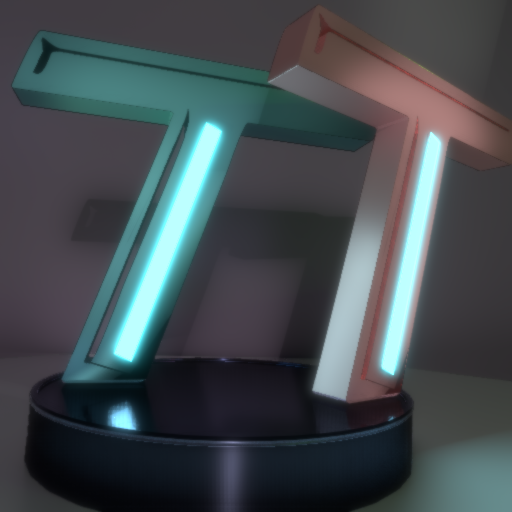
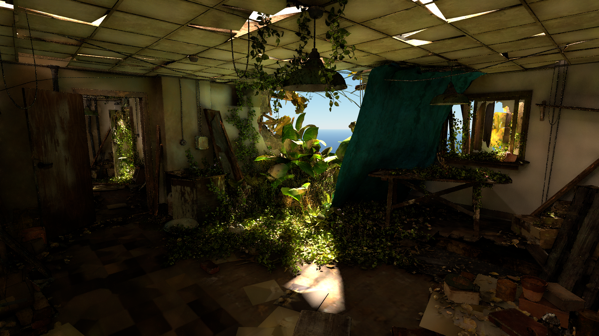
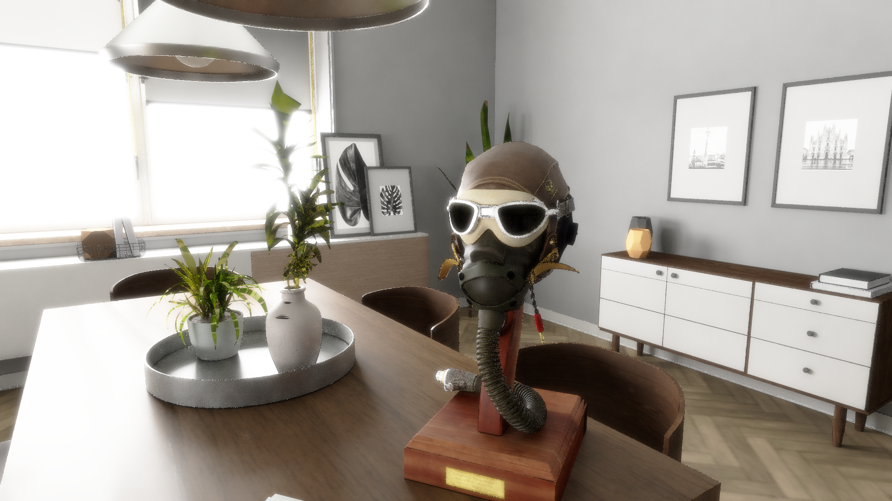
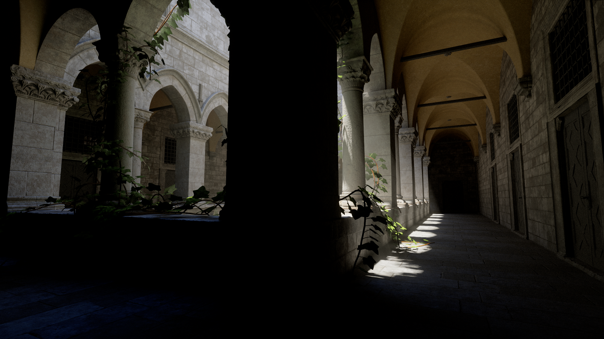

# Hello! And welcome to my small page!

## This is a small showcase of what I have done, and what is publicly available to others
### First off, the main event: TrueTrace, my realtime unity compute shader pathtracer! 
### With features such as:
<ul>
  <li>Completely compute based pathtracing - itll run on any GPU!</li>
  <li>ASVGF and SVGF denoisers</li>
  <li>ReSTIR GI For fast accumulation of complexly lit scenes</li>
  <li>Full support for skinned meshes</li>
  <li>Full support for PBR textures and effects with the Disney BSDF</li>
  <li>Fully dynamic objects, allowing them to move independantly in real time</li>
</ul>
[Github](https://github.com/Pjbomb2/TrueTrace-Pathtracer)
 
[Asset Store](TempLink)
 

### Sample Renders:

 | 
 | 
# Embergen VDB Loader:
[Github](https://github.com/Pjbomb2/Unofficial-Basic-Embergen-VDB-Loader-for-Unity)

# How to Contact:
[Twitter](https://twitter.com/Pjbomb2)
Discord: Pjbomb2#6129
