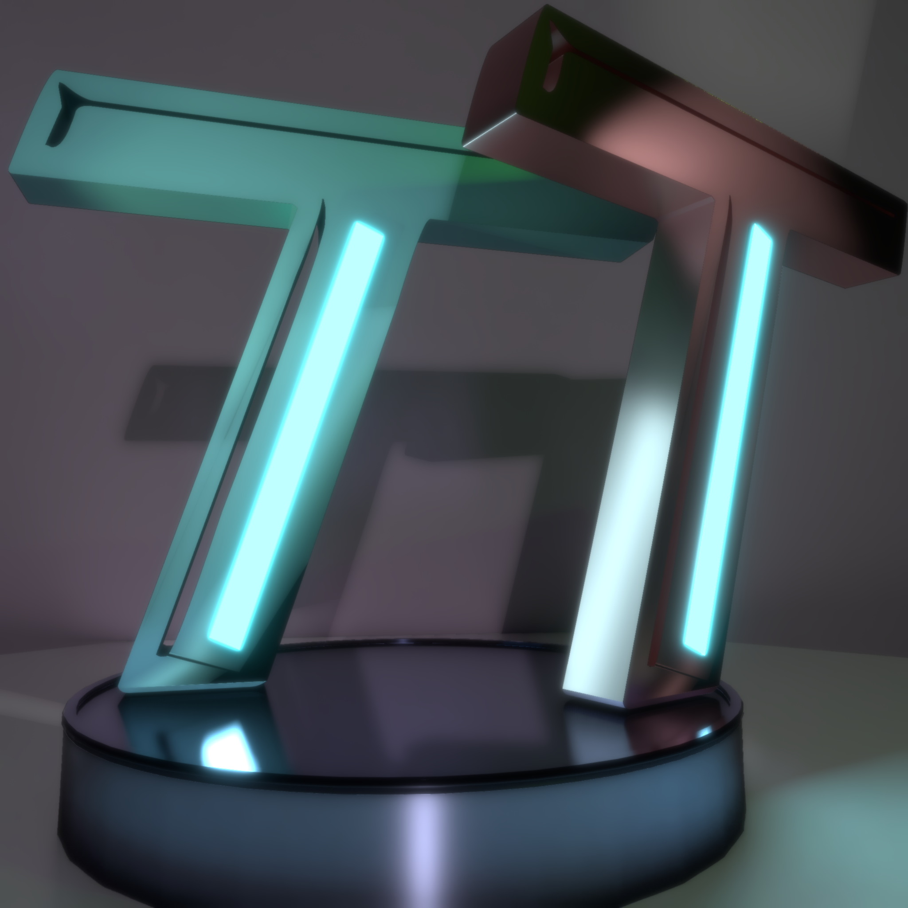

# Hello! And welcome to my small page!

## This is a small showcase of what I have done, and what is publicly available to others
## Methods of Contact:
Twitter: https://twitter.com/Pjbomb2
 
Discord: Pjbomb2#6129
 
Email: paytonleather@gmail.com
### First off, the main event: TrueTrace, my realtime unity compute shader pathtracer! 
### With features such as:
<ul>
  <li>Completely compute based pathtracing - itll run on any GPU!</li>
  <li>ASVGF and SVGF denoisers</li>
  <li>ReSTIR GI For fast accumulation of complexly lit scenes</li>
  <li>Full support for skinned meshes</li>
  <li>Full support for PBR textures and effects with the Disney BSDF</li>
  <li>Fully dynamic objects, allowing them to move independantly in real time</li>
</ul>

[Github](https://github.com/Pjbomb2/TrueTrace-Pathtracer)
 
[Asset Store](TempLink)
 

### Sample Renders:

 | 
 | 

### Secondly, a simple VDB Loader for Embergen to Unity:
<ul>
  <li>Easily load VDB grids from Embergen into unity</li>
  <li>Contains the functions needed to read from the grids into your own format</li>
  <li>Contains a simple renderer of Embergen grids that indcludes direct shadowing</li>
</ul>

[Github](https://github.com/Pjbomb2/Unofficial-Basic-Embergen-VDB-Loader-for-Unity)
 

### Finally, a simple emission mask maker for Unity:
<ul>
  <li>Creates an emission mask from existing textures based on your parameters</li>
  <li>Allows simple deletion of sections via mouse drag to exclude sections from the mask</li>
  <li>Easily export as a file to the unity assets folder</li>
</ul>

[Github](https://github.com/Pjbomb2/Unity-Emission-Mask-Maker)
